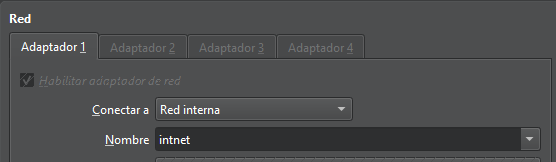
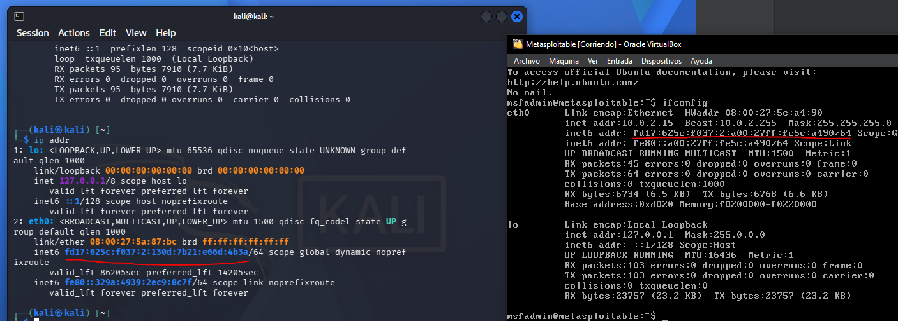
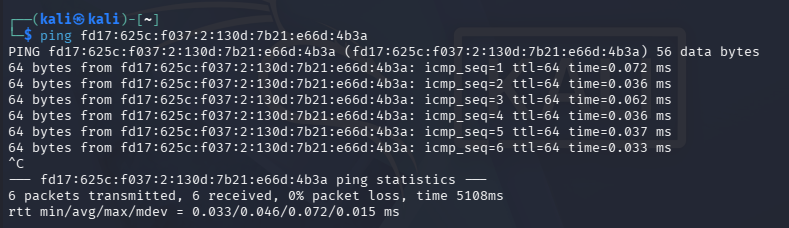
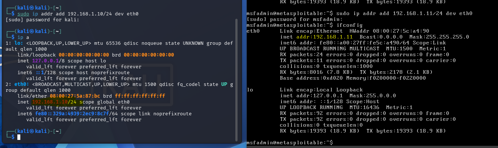
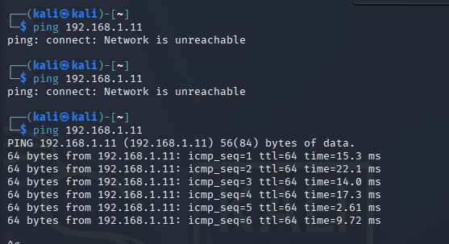
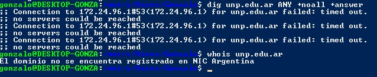
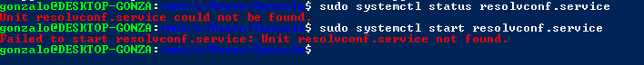
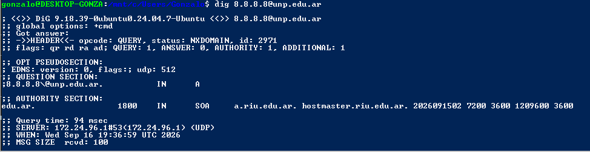
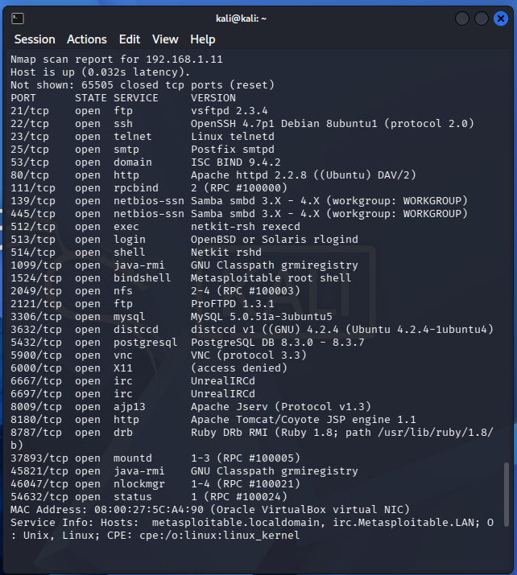

# Trabajo Práctico 3 - Reconocimiento y escaneo

## Parte A — Armado del laboratorio

Se logró instalar ambas máquinas virtuales sobre el mismo dispositivo utilizando VirtualBox. Se las configuró con **una red interna en común**, sin que estén conectadas a internet.



Se guardó una snapshot inicial de la VM que será atacada.

### Asignación de IPs
Al conectar las máquinas virtuales a la red interna, se les asignó sólo una IPv6 a cada una, con un sufijo de red /64 (64 bits asignados a la subred).

Esto sirve para nuestros fines, y se puede comprobar que las IPs pertenecen a la misma subred.

|IP Kali|IP Metasploitable|
|-|-|
|fd17:625c:f037:2:130d:7b21:e66d:4b3a/64|fd17:625c:f037:2:a00:27ff:fe5c:a490/64|



Además, a continuación se comprueba que las máquinas pueden comunicarse entre sí, realizando un ping desde Kali.



Pero como las IPv6 son poco prácticas para trabajarlas (el copiar y pegar entre las MVs no es tan fácil), decidí asignarles manualmente IPv4. En el caso de kali, tuve que desactivar el DHCP para que no se rechace su conexión a la red virtual.

**A la máquina de kali le asigné `192.168.1.10/24` y a metasploitable, ``192.168.1.11/24`**



A continuación se puede ver un ping exitoso de kali a metasploitable.



Se tomaron instantáneas de las máquinas con esta configuración.

## Parte B - Reconocimiento pasivo (OSINT)
Para esta parte voy a utilizar el bash de Linux de WSL en lugar de la máquina virtual de Kali, ya que ésta la estamos manteniendo desconectada de internet (sólo tiene conexión con la otra MV, como se describió en la parte A).

Sin embargo, me encontré con que el servidor DNS para el comando `dig` hace un timeout, y que el `whois` responde que el dominio no está registrado.



Ante la sugerencia del docente de probar cambiar a los DNS de Google, fui a averiguar cómo hacerlo desde la terminal de bash. Me encontré con [ésta guía](https://www.ionos.co.uk/digitalguide/server/configuration/change-dns-server-on-ubuntu/) cuya solución emplea un paquete `resolvconf`.

```
sudo apt update
sudo apt upgrade
sudo apt install resolvconf
```

Sin embargo, me atoré en el paso 2. Aparentemente, en WSL tanto el DNS como los servicios no se pueden manejar así.



Le consulté a Gemini y me instó a configurar el archivo `/etc/wsl.conf`, donde debo configurar las IPs de los servers que deseo (8.8.8.8 y 8.8.4.4) y desactivar una sobreescritura que Windows hace sobre la configuración de DNS.

**Pero!** En el medio de esto recibí una respuesta de Zape en el grupo. Resulta que para el comando `dig`, se puede poner `@8.8.8.8` antes del nombre. Así, el comando me devolvió la información correctamente.



> Lamentablemente, esta solución no sirve para solucionar el problema con whois, ya que, de hecho, whois no hace consultas DNS. Es un protocolo que utiliza un puerto distinto y tiene ese único fin


## Parte C - Escaneo del laboratorio (contra Metasploitable)

### Punto 1
*Completá una tabla con puerto / estado / servicio / versión de al menos ocho servicios abiertos.*

Este es el resultado obtenido en escaneo_completo.txt mediante el comando `sudo nmap -sS -sV -p- 192.168.56.101 -oN escaneo_completo.txt`




**8 SERVICIOS**

| Puerto | Estado | Servicio | Versión |
|-|-|-|-|
|21/tcp|open|ftp|vsftpd 2.3.4|
|22/tcp|open|ssh|OpenSSH 4.7p1 Debian|
|5432/tcp|open|postgresql|PostgreSQL DB 8.3|
|80/tcp|open|http|Apache httpd 2.2.8|
|23/tcp|open|telnet|Linux telnetd|
|25/tcp|open|smtp|Postfix smtpd|
|139/tcp|open|netbios-ssn|Samba smbd 3.X - 4.X|
|3306/tcp|open|mysql|MySQL 5.0.51a-3ubuntu5|

### Punto 2
*Elegí tres servicios y buscá en Exploit-DB o NVD si su versión tiene una vulnerabilidad conocida (CVE). Anotá el identificador y una línea de descripción.*

Elegimos **postgresql 8.3, openSSH 4.7p1 y MySQL 5.0.51a**, por ser algunos servicios muy utilizados hoy en día.

#### PostgreSQL 8.3
*CVE-2012-3489 - Severidad 6.5 MEDIUM* 
Permitía a un usuario autenticado hacer consultas que le permitan escanear la existencia de un archivo externo, ya que el servicio devolvía un error distinto si un archivo existía o no. Además, este error contenía información del archivo.

[Fuente](https://nvd.nist.gov/vuln/detail/cve-2012-3489?st_source=ai_overview)

#### OpenSSH 4.7p1
*CVE-2018-15473 - Severidad 5.3-5.9 MEDIUM*
Permitía un escaneo de usuarios mediante la medición de cuánto tiempo tarda en rechazarse a un usuario/contraseña. No exponía credenciales pero sí te permitía averiguar nombres de usuario válidos.
Esta vulnerabilidad estuvo presente incluso hasta la versión 7.7.

[Fuente](https://nvd.nist.gov/vuln/detail/cve-2018-15473)

#### MySQL 5.0.51a
*CVE-2010-1848 - Severidad 6.5 MEDIUM*
Permitía a un usuario autenticado evadir las restricciones de acceso a tablas mediante un ataque de directory traversal. Utilizando .. en el nombre de una tabla, podía acceder a definiciones de campos de tablas arbitrarias y, en determinadas versiones, incluso leer o eliminar su contenido.

[Fuente](https://nvd.nist.gov/vuln/detail/cve-2010-1848)

### Punto 3
*¿Qué diferencia observaste entre el escaneo -sS solo y el -sV? ¿Por qué la versión es tan importante para un atacante?*
Con el -sV podemos ver las versiones instaladas en el equipo. Esto es fundamental para el atacante ya que con esto puede buscar vulnerabilidades aplicables a las versiones que encuentre.

### Punto 4
*Interpretá un puerto filtered si aparece: ¿qué lo produce?*
No apareció en nuestro escaneo ningún caso. De acuerdo a [cPanel](https://support.cpanel.net/hc/en-us/articles/360051526613-What-s-the-difference-between-a-closed-port-and-a-filtered-port?st_source=ai_overview), esto se produce cuando existe algún firewall o filtro en el enrutador que esté bloqueando la conexión.

## Parte D — Análisis y defensa

| Servicio / versión | CVE | Riesgo (CVSS aprox.) | Cómo lo detectaría un defensor | Contramedida |
|---|---|---|---|---|
| PostgreSQL 8.3 (5432/tcp) | CVE-2012-3489 | 6.5 · Medio [1] | | |
| OpenSSH 4.7p1 (22/tcp) | CVE-2018-15473 | 5.3 · Medio [2] | | |
| MySQL 5.0.51a (3306/tcp) | CVE-2010-1848 | 6.5 · Medio [3] | | |

### Referencias

- [1] NVD — CVE-2012-3489: [https://nvd.nist.gov/vuln/detail/CVE-2012-3489](https://nvd.nist.gov/vuln/detail/CVE-2012-3489)
- [2] NVD — CVE-2018-15473: [https://nvd.nist.gov/vuln/detail/CVE-2018-15473](https://nvd.nist.gov/vuln/detail/CVE-2018-15473)
- [3] NVD — CVE-2010-1848: [https://nvd.nist.gov/vuln/detail/CVE-2010-1848](https://nvd.nist.gov/vuln/detail/CVE-2010-1848)